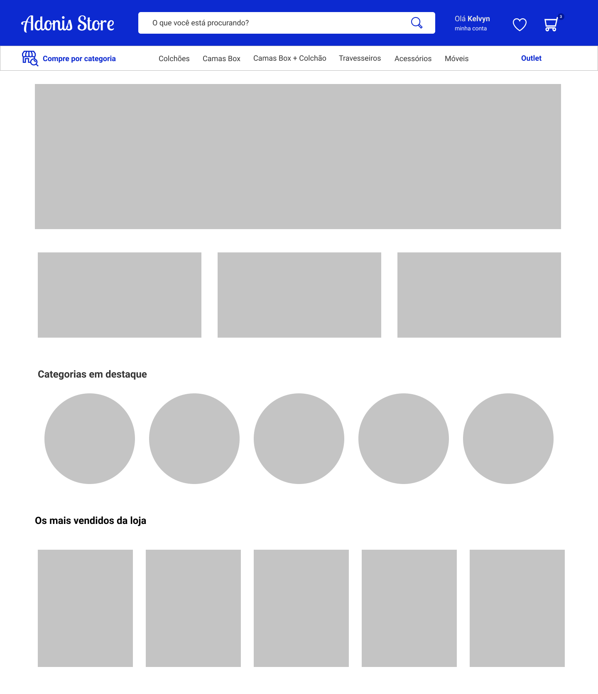

# Ecommerce Adonis JS



## Como rodar esse projeto

Clone esse repositório digitando o seguinte comando em seu terminal:

```bash
git clone https://github.com/jceletro/ecommerce.git
```

Para rodar esse projeto é necessario  que você tenha o Node.JS instalado, e o Framework Adonis.JS.

Com as dependecias instaladas, na pasta do projeto rode o seguinte comendo para instalar as dependências do projeto:

```bash
yarn
# ou se usa NPM rode
npm install
```

### Migrações

Com o banco de dados configurado no arquivo .env, rode o seguinte comando em seu terminal:

```bash
adonis migration:run
```